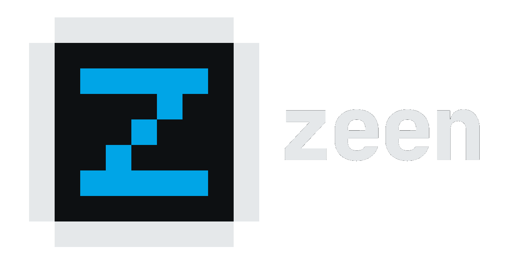

<p align="center">
  
</p>

<h1 align="center">doc-agent-ai</h1>

<p align="center"><strong>Zeen-branded multi-platform documentation workflow agent.</strong><br>Single binary — download and run. No Node.js, no npm, no dependencies.</p>

<p align="center">
  <a href="https://opensource.org/licenses/MIT"></a>
  <a href="https://go.dev"></a>
</p>

<p align="center"><strong>Install once, document everywhere</strong> across opencode, Claude Code, GitHub Copilot, Qwen Code, and Pi.</p>

## Why it exists

`doc-agent-ai` gives teams one consistent documentation workflow across multiple AI coding platforms without dragging a JavaScript toolchain into the install path.

- One binary
- One command surface
- One documentation flow
- Multi-platform installation

Its defining property is that **the interview is conversational and the bookkeeping is not.** The model decides what to ask, how to phrase it and when to dig deeper. A deterministic program decides which phase you are in, whether a phase is complete, and what happens next — counted from what you actually answered, never from a claim the model makes about its own work.

> **v5.0.0** — Completion is now computed from recorded answers instead of checkboxes the model wrote. Documentation created before this release has no such records: run `doc-agent-ai doctor --node <system> --check` to adopt it. See [CHANGELOG →](./CHANGELOG.md).

---

## Quick start

**macOS (Homebrew):**

```sh
brew tap zeshone/tap
brew install doc-agent-ai
doc-agent-ai
```

**Windows (Scoop):**

```powershell
scoop bucket add zeshone https://github.com/zeshone/scoop-bucket
scoop install doc-agent-ai
doc-agent-ai
```

**Linux or direct download:** grab the binary for your platform from [Releases](https://github.com/zeshone/doc-agent-ai/releases/latest), then:

```sh
chmod +x doc-agent-ai   # not needed on Windows
./doc-agent-ai
```

The bare binary opens the Zeen Home menu. Choose **Install** to run the wizard, **Uninstall** to remove the installed artifacts, or use headless `install --platforms ...` in CI.

Restart your AI tool after install. Then type `/doc-arch my-system` to start documenting.

---

## Platforms

| Platform | Support |
|----------|---------|
| [opencode](https://opencode.ai) | Prompts, commands, agents, skill-registry |
| [Claude Code](https://claude.ai) | Prompts, agents, skill-registry |
| [GitHub Copilot](https://github.com/features/copilot) | Prompts, agents |
| [Qwen Code](https://tongyi.aliyun.com) | Prompts, agents |
| [Pi](https://github.com/earendil-works/pi) | Prompts, skills, skill-registry |

Pi consumes role definitions as prompt templates (no separate agent registry). The installer detects `~/.pi/agent` or `pi` on `PATH`. Override with `--pi-path <path>` or set `PI_CODING_AGENT_DIR`.

The `doc-reader` skill is installed on every platform with a skills directory when **in-project docs mode** is selected. It teaches agents to use only the compacted `/doc-to-sdd` context files (`docs/doc-agent/agent_sdd_context_project/`) and to skip the full docs tree. Switching back to vault mode automatically removes it.

---

## Commands

| Subcommand | What it does |
|------------|--------------|
| `generate <dir>` | Write the rendered bundle to an explicit directory (dev/build only) |
| `install` | TUI installer — platform selection, docs mode (vault / in-project), overwrite confirmation |
| `uninstall` | TUI uninstaller — removes only doc-agent-ai artifacts, leaves your docs untouched |

### Pipeline subcommands

The agent calls these; you rarely will. Each prints versioned JSON, so the model routes on typed state instead of on what it remembers.

| Subcommand | What it does |
|------------|--------------|
| `status --node <n>` | Where a node stands: phase states, coverage counts, what to run next |
| `topics --phase <p> --node-type <t>` | The topics a phase must cover |
| `validate` | Check a phase submission without writing anything |
| `commit-phase` | Validate a submission and write it only if it passes |
| `decide-phase` | Record a decision about an optional phase, so it is not re-asked |
| `sdd-commit` | Verify and write the compacted agent context |
| `doctor --node <n> [--check\|--apply]` | Adopt documentation written before this release |

Exit codes: `0` affirmative, `1` usage or environment error, `2` refused verdict. A rejection is a successful run with a negative verdict, not a broken invocation.

#### Adopting existing documentation

Documentation written before v5.0.0 has no answer records, so its coverage cannot be verified. `doctor` marks those phases **adopted** — present and usable, coverage explicitly unverified — which does not block new work and never claims a check that never happened.

```sh
doc-agent-ai doctor --node <system> --check --recursive   # report, change nothing
doc-agent-ai doctor --node <system> --apply --recursive   # adopt
```

It reports by default. `--apply` is opt-in because the command touches documentation you wrote by hand.

### Headless install (CI / scripts)

Any install flag skips the TUI entirely:

```sh
doc-agent-ai install --platforms opencode,claude --docs-mode vault --path /home/you/docs/ --yes
```

| Flag | Meaning |
|------|---------|
| `--platforms <csv>` | Comma-separated platform IDs (`opencode,claude,copilot,qwen,pi`); omit for all detected |
| `--docs-mode <mode>` | `vault` (fixed base path) or `in-project` (`docs/doc-agent/` per repo) |
| `--path <path>` | Vault base path (required for vault mode unless saved in config) |
| `--yes` | Skip confirmations; alone, reuses saved config defaults — needs `--path` on a fresh machine |

The chosen mode and path persist in `~/.doc-agent-ai.json` and pre-fill the next install. A per-project `.doc-agent.json` marker (`{"mode": "in-project"}`) overrides the global mode for that repository.

---

## Phases

The documentation workflow has **7 phases** (one optional):

```text
idea -> rec -> prd -> refine -> tech -> [ddd] -> pti
              └─────────────────────────────────┘
                            ddd is optional
```

| Command | Phase | Output |
|---------|-------|--------|
| `/doc-idea <system>` | Idea refinement — turn a vague concept into a clear product direction | Master index description (+ optional `_idea-brief.md`) |
| `/doc-rec <system>` | Requirements elicitation | `_requirements.md` |
| `/doc-prd <system>` | Product Requirements Document | `_prd.md` |
| `/doc-refine <system>` | User story audit against INVEST criteria | `_refinement.md` (+ updated `_prd.md` user stories on approval) |
| `/doc-refine` | Standalone refinement of a single user story | Inline refined story |
| `/doc-tech <system>` | Technical specification | `_tech-spec.md` |
| `/doc-ddd <system>` | Optional — Database Design Document | `_db-design.md` |
| `/doc-pti <system>` | Issues breakdown | `_issues.md` |
| `/doc-arch <system>` | Full flow (all 6 + optional ddd) | All of the above |
| `/doc-to-sdd <system>` | Standalone — compact docs into LLM-optimized context so an agent reads two documents instead of seven | `agent_sdd_context_project/_sdd-context.md` and `_sdd-tech-context.md`, plus a manifest of what they were derived from |

### What the program guarantees

| Guarantee | How |
|---|---|
| A phase cannot claim coverage it does not have | Every required topic needs an answer on record, carrying your own words and the question that produced them |
| A rejected submission writes nothing | The program holds the pen: it validates first and returns before touching a file |
| Document structure is checkable in any language | Section headings are canonical English rendered by the program; the prose beneath is written in your documentation language |
| An acknowledged gap stays visible | A topic you defer counts as covered, renders an explicit TBD, and stays counted in every status report |
| A quality gate cannot pass on content since rewritten | The story audit is anchored to the prose it judged; correcting those stories invalidates it until re-run |
| A compacted agent context cannot go stale invisibly | Its manifest fingerprints every source, and status reports it fresh, stale or absent |

What it deliberately does **not** do is judge whether an answer is good, whether a summary is faithful, or whether a quote fits its topic. Those are judgements about meaning, and a check claiming to make them would be theatre. What the program does is make them auditable: everything it counts, you can read.

### Modules

```text
/doc-idea <system>/<module>      ← individual phase for a module
/doc-rec <system>/<module>       ← individual phase for a module
/doc-prd <system>/<module>
/doc-refine <system>/<module>
/doc-tech <system>/<module>
/doc-ddd <system>/<module>       ← optional DB design for a module
/doc-pti <system>/<module>
/doc-mod <system> <module>       ← full module flow (all phases, ddd optional)
```

---

## Update

```sh
brew upgrade doc-agent-ai     # macOS
scoop update doc-agent-ai     # Windows
```

Or download the new binary from [Releases](https://github.com/zeshone/doc-agent-ai/releases/latest) and run `install` again. Your documentation files live in your chosen projects path — never touched by install or uninstall.

---

## Maintenance

This project uses a **single-source → embed → generate → install** architecture. All canonical content lives in `src/` and `skills/`, embedded into the binary at compile time via `//go:embed`.

### Source of truth

```text
src/
  content/          ← canonical agent/prompt/command content
  manifests/        ← declarative metadata (platforms, roles, commands)
  templates/        ← platform-specific wrappers (.tmpl)
skills/             ← skill definitions shared across platforms
```

### Modify the agent

1. Edit files under `src/` or `skills/`.
2. Run `go run ./cmd/doc-agent-ai generate <dir>` to write a rendered bundle for inspection or packaging.
3. Run `go run ./cmd/doc-agent-ai` to open the installer UI, or `go run ./cmd/doc-agent-ai install --platforms ...` for headless install.
4. Commit. Generated output directories remain disposable — `src/` and `skills/` are still the source of truth.

### Build from source

```bash
git clone https://github.com/zeshone/doc-agent-ai.git
cd doc-agent-ai
go build -o doc-agent-ai ./cmd/doc-agent-ai
./doc-agent-ai
```

### Authoring conventions

- Canonical skill/role names: `doc-arch`, `doc-idea`, `doc-rec`, `doc-prd`, `doc-refinement`, `doc-tech`, `doc-ddd`, `doc-pti`, `doc-feat`, `doc-scope`, `doc-rec-lite`, `doc-prd-lite`, `doc-to-sdd`, `doc-reader` (conditional — in-project mode only)
- Command names mirror their skill with the `doc-` prefix, with two deliberate divergences: `/doc-refine` triggers the `doc-refinement` skill, and `/doc-mod` (module flow) is handled by `doc-arch`
- Progressive workflow depth: `idea` (product framing) → `rec` (executive/business elicitation) → `prd` (technical but clear) → `refine` (story quality gate) → `tech` (maximum precision, still legible) → [`ddd` (structured data design, ERD, constraints, rationale)] → `pti` (executable issues)
- `ddd` is optional. Triggered explicitly, by hard signals (schema files, DBMS mentions), or by orchestrator prompt between `tech` and `pti`. Dismissed for in-memory or ephemeral systems.
- Local-first issues. GitHub only on explicit request.
- Language detection on first contact. Documentation language asked once per system.
- **All skills in English.** The author works primarily in Spanish — occasional Spanish fragments in skill instructions are unintentional artifacts of the authoring workflow. All skill content must be delivered in English for global accessibility. PRs with non-English skill content will be flagged.
- Never assume missing context — ask or mark `TBD`.

---

## Uninstall

Use the Home menu's **Uninstall** option, or run the dedicated subcommand when you want to remove the installed artifacts directly:

```bash
./doc-agent-ai uninstall
```

Uninstall removes skills, prompts, commands, and agent registrations from detected platforms. Your documentation files are never touched.

---

## License

MIT © 2026 [Zesh-One](https://github.com/zeshone)
